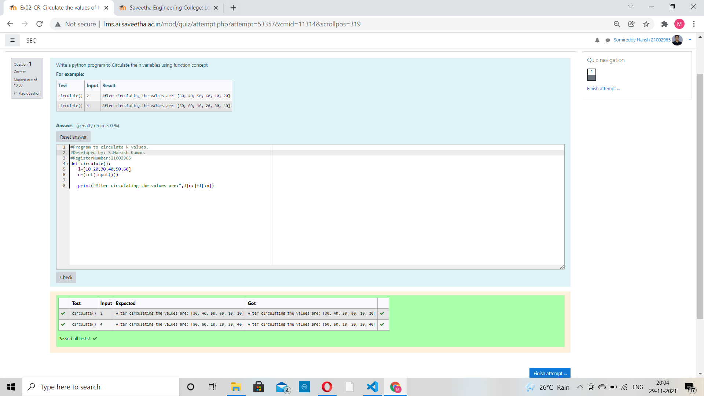

# Circulate-the-values-of-N-variables
## Aim:
To write a python program to circulate the n variables using function concept
## Equipment’s required:
PC
Anaconda - Python 3.7
## Algorithm: 
### Step 1:
 create an list of values.
### Step 2: 
Get th index  value from the user
### Step 3: 
Get the value from the user for the number of rotation
### Step 4: 
Using the slicing concept rotate the list

## Program:
~~~ python
#Program to circulate N values.
#Developed by: S.Harish Kumar.
#RegisterNumber:21002965
def circulate():
 l=[10,20,30,40,50,60]
 n=(int(input()))

 print("After circulating the values are:",l[n:]+l[:n])
 ~~~
## Output:

## Result:
Thus the Circulating the values of N variables are successfully executed.
